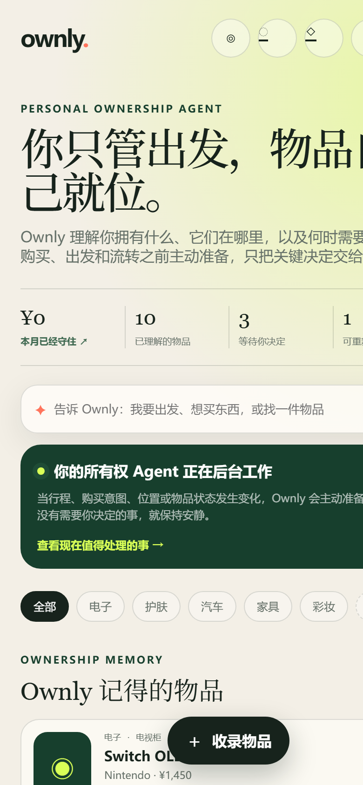
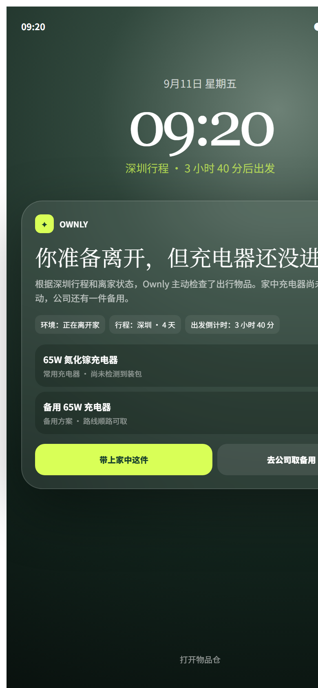
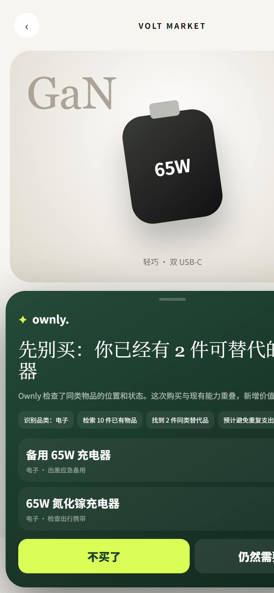
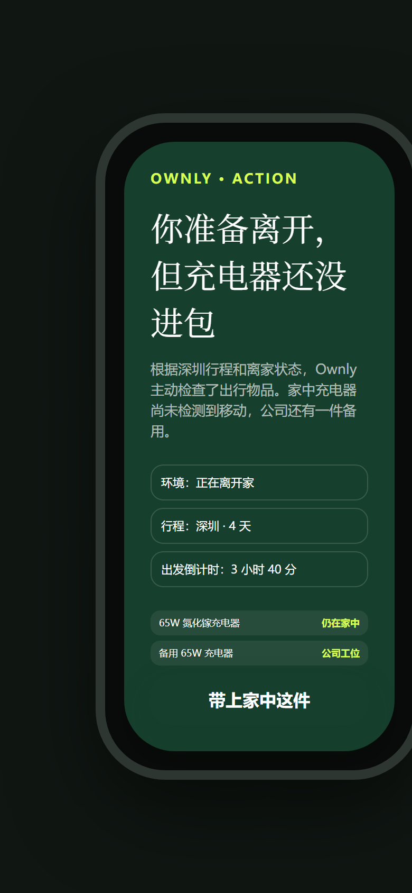
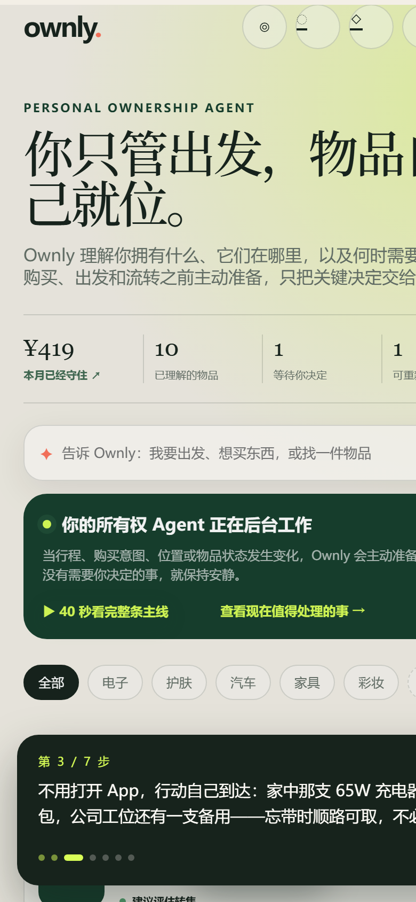

# Ownly

Ownly is a personal ownership agent that understands what a person owns, what they intend to do, and which objects should become available for the situation ahead.

The product is not an inventory manager or an after-sales assistant. Its ownership graph stays in the background while the Agent intervenes before purchases, departures, maintenance decisions, and ownership transfers. Return protection, price protection, warranty memory, duplicate-purchase checks, and resale are actions inside that broader ownership layer.

<table>
<tr>
<td></td>
<td></td>
<td></td>
<td></td>
</tr>
<tr>
<td align="center">主页：你只管出发</td>
<td align="center">锁屏：无需打开 App</td>
<td align="center">购前：先别买</td>
<td align="center">手表：一键授权</td>
</tr>
</table>

## 60 秒快速体验

**最快的方式**：打开 <http://127.0.0.1:8765/?tour=1>，或点主页上的「**▶ 40 秒看完整条主线**」。导览会用真实接口把下面的主线自己走一遍，底部讲解条说明每一步该看什么、它为什么重要——走的就是用户自己能走的那条路，没有为演示专设的假路径。



想自己动手，就按下面的顺序：

**1. 不打开 App，通知自己到达** — 打开 <http://127.0.0.1:8765/ambient>

锁屏上直接出现：*"你准备离开，但充电器还没进包"*。逐项检查来自真实物品档案——家中那支 65W 充电器尚未装包，公司工位还有一支备用，所以忘带时顺路可取，不用回家。这是整个产品命题的最短证明。

**2. 看 Agent 为什么这样做** — 回到 <http://127.0.0.1:8765/>，点「查看现在值得处理的事」

生成 5 张待处理卡（补货 / 清洁 / 保价 / 退货期 / 闲置转售）。展开任意一张的「查看 Agent 为什么这样做」，可以看到六阶段过程（感知 → 判断 → 规划 → 授权 → 执行 → 验证）、支持证据、**反证**，以及它命中了哪条长期策略。

**3. 出发卡** — 依次处理补货、清洁、保价三张，再点一次「查看现在值得处理的事」

Agent 把行程与物品位置合成一张出发清单：哪些必须携带、哪些无需补货、哪些可以到公司再取。

**4. 跨设备交接** — 点「生成清单」，再打开 <http://127.0.0.1:8765/watch>

同一条行动出现在手表上，一键授权即可。

**5. 价值账单** — 点主页右上角的金额

每一笔都有依据；「处理中」和「潜在机会」不会被计入「已经守住」，避免重复计算。

**还可以试**：在主页输入框说 *"我想买一个 65W 充电器"* —— Agent 会先检索你已有的物品，然后给出"先别买"的判断，并说明理由；说 *"我下周去深圳四天，帮我准备"* 会生成完整的出行方案。

## 运行

项目仅依赖 Python 3 标准库：

```powershell
python app.py
```

然后访问 <http://127.0.0.1:8765>。用户可以表达购买、出发、寻找或处理物品的意图；Agent 也会结合物品状态主动生成当前值得处理的任务。系统级购物介入位于 <http://127.0.0.1:8765/shop>，环境服务位于 <http://127.0.0.1:8765/ambient>，Watch 授权交接位于 <http://127.0.0.1:8765/watch>。

Switch OLED 演示物品包含从订单、物流、签收、保价、使用、闲置到转售的持久化生命周期。在转售任务中点击"生成转售资料"后，会出现包含标题、描述、成色、价格和图片清单的真实草稿；确认发布并模拟售出后，物品退出活跃仓，历史事件继续保留。

运行测试（34 项）：

```powershell
python -m unittest discover -s tests -v
```

## 原型边界

- 物品、生命周期事件和 Agent 任务保存在本地 SQLite 数据库。
- 账本里的历史流水（价保到账、避免重复购买）与演示物品一样属于设定数据，用来展示月度账单的形态；演示过程中真实产生的金额会追加在后面。
- 用户对购前建议的反馈会成为结构化长期记忆，并改变下一次同类判断；用户也可以要求重新评估。
- 自然语言感知目前使用可解释规则；真实 Vision/LLM adapter 尚未接入。
- 日历、天气、商家价格变化和保价提交均为可重复验证的模拟工具，并在代码中明确标注 adapter 边界。
- Dynamic UI 由 Agent 输出的受限 schema 生成，未声明动作会被服务端拒绝。
- 发布、支付和所有权转移始终需要用户确认，切换自主模式不会取消这三类确认。
- 后续可将相同接口替换为真实 Vision、商家服务和 Agent OS 能力。

产品命题见 [PRODUCT.md](PRODUCT.md)，系统边界见 [ARCHITECTURE.md](ARCHITECTURE.md)，开源调研见 [OPEN_SOURCE_RESEARCH.md](OPEN_SOURCE_RESEARCH.md)。

## 许可证

[MIT](LICENSE) © 2026 Yumm-del
